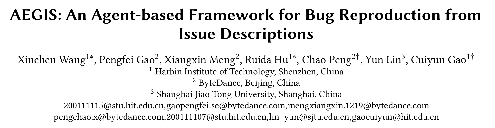

# AEGIS

<p align="center">
  
</p>

<p align="center">
  <a href="https://dl.acm.org/doi/abs/10.1145/3696630.3728557"></a>
  <a href="https://opensource.org/licenses/MIT"></a>
</p>

An Agent-based Framework for General Bug Reproduction from Issue Descriptions.

## Features

**Bug-related context summarization module**  
   - Condensing the retrieved bug-related information into structural context through reranking and summarization.

**Finite state machine (FSM)-guided script generation module**  
   - Guiding the script modification process utilizing the proposed FSM and predefined modification rules.

## News
We are excited to announce that **AEGIS** has achieved **2nd place** on the [SWT-Bench leaderboard](https://swtbench.com/?results=verified)!

## Prerequisites

- Python 3.x
- Docker
- Git

## Usage

You can execute the `run.sh` script with the following arguments:

```bash
python3 main.py \
    --instances_path "data/samples.jsonl" \
    --log_path "./experiments/log" \
    --patches_path "./experiments/patch" \
    --output_path "./experiments/output" \
    --namespace "PyAirbyte"
```

Please note that our "Bug-related context summarization" module contains proprietary code and is not available for full open-sourcing.
However, the core logic can be effectively replicated using the publicly available [Trae Agent](https://github.com/bytedance/trae-agent). We recommend adapting this as a suitable replacement for this module.

## Project Structure

- `agents/` - Agent implementations for bug reproduction
- `data/` - Datasets used for bug reproduction
- `docker/` - Docker-related configurations
- `experiments/` - Experiment results
- `tools/` - External tools for bug reproduction
- `utils/` - Utility functions and helper classes
- `main.py` - Main entry point
- `run.sh` - Shell script for executing the `main.py`

## Citation

```bibtex
  @inproceedings{10.1145/3696630.3728557,
    author = {Wang, Xinchen and Gao, Pengfei and Meng, Xiangxin and Peng, Chao and Hu, Ruida and Lin, Yun and Gao, Cuiyun},
    title = {AEGIS: An Agent-based Framework for Bug Reproduction from Issue Descriptions},
    year = {2025},
    isbn = {9798400712760},
    publisher = {Association for Computing Machinery},
    address = {New York, NY, USA},
    url = {https://doi.org/10.1145/3696630.3728557},
    doi = {10.1145/3696630.3728557},
    booktitle = {Proceedings of the 33rd ACM International Conference on the Foundations of Software Engineering},
    pages = {331–342},
    numpages = {12},
    keywords = {bug reproduction, large language models, AI agent},
    location = {Clarion Hotel Trondheim, Trondheim, Norway},
    series = {FSE Companion '25}
  }
```

## License

MIT

## Ackowledgement

https://github.com/Aider-AI/aider
https://github.com/bytedance/trae-agent
https://swtbench.com/?results=verified
